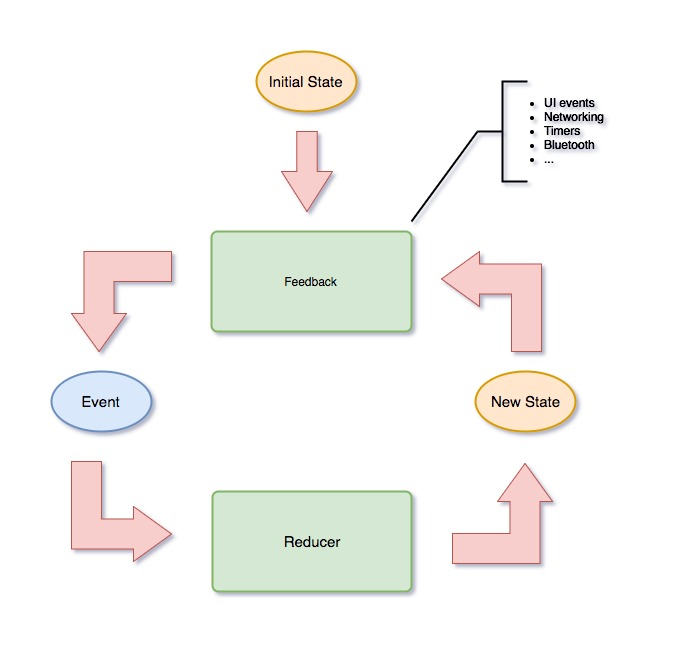

# ReactiveFeedback

Unideraction reactive architecture. This is [ReactiveSwift](https://github.com/ReactiveCocoa/ReactiveSwift) implemetation of the [RxFeedback](https://github.com/kzaher/RxFeedback)

## Documentation



### Motivation

Requirements for iOS apps have become huge. Our code has to manage a lot of state e.g server responses, cached data, UI state, routing etc. Some may say that Reactive Programming can help us a lot, but in wrong hands, it can make even more harm to your code base.

The goal of this library to provide a simple and intuitive approach to design reactive state machines.

### Core Concepts

##### State 

Is a single source of truth. It represents a state of your system. Usually, plane swift type (does not contain any ReactiveSwift primitives) to the point that it can be saved on disk. The only way to change a `State` is to emit an `Event`

```swift
enum State {
    case loading
    case loaded([Item])
}
```

##### Event

Represent all possible events that can happen in your system which can transition to a new value of the `State`

```swift
enum Event {
    case startLoadingNextPage
    case loaded([Movie])
    case failed(Error)
    case retry
}
```

##### Reducer 

Is a pure function of `(State, Event) -> State`. This is the only place where the `State` can be changed.

```swift
func reduce(state: State, event: Event) -> State {
    switch event {
    case .startLoadingNextPage:
        return .paging(context: state.context)
    case .response(let batch):
        var copy = state.context
        copy.batch = batch
        copy.movies += batch.results
        return .loadedPage(context: copy)
    case .failed(let error):
        return .error(error: error, context: state.context)
    case .retry:
        return .retry(context: state.context)
    }
}
```

##### Feedback

Represents effects that may happen in your system that somehow can mutate the `State`, e.g (UI events, Networking, DB fetches, timers, Bluetooth ...). Essentially it's a pure function of `Signal<State, NoError> -> Signal<Event, NoError>`

```swift
public struct Feedback<State, Event> {
    public let events: (Scheduler, Signal<State, NoError>) -> Signal<Event, NoError>
}
```

### The Flow

As you can see from the diagram above that we always have an initial state, then we go through all `Feedback`s that we have in our system and see whether we want to perform any effects (e.g if load new data from the server). Then we wrap it into an `Event` and go to reducer where we produce a new `State` having a previous value of the `State` and an `Event`. 

##### Example
```swift
        let increment = Feedback<Int, Event> { _ in
            return self.plussButton.reactive
                .controlEvents(.touchUpInside)
                .map { _ in Event.increment }
        }
        
        let decrement = Feedback<Int, Event> { _ in
            return self.minusButton.reactive
                .controlEvents(.touchUpInside)
                .map { _ in Event.increment }
        }
        
        let system = SignalProducer<Int, NoError>.system(initial: 0,
                                                         reduce: { (count, event) -> Int in
                                                            switch event {
                                                            case .increment:
                                                                return count + 1
                                                            case .decrement:
                                                                return count - 1
                                                            }
        },
                                                         feedbacks: [increment, decrement])
        
        label.reactive.text <~ system.map(String.init)


```

]

### Adwantages 

TBD
